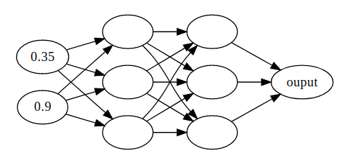

# test_net

simple fcn

## use
```bash
make && ./example/nn
```

## example nn network


## result
```bash
cost: 0.317411
cost: 0.115414
cost: 0.0509559
cost: 0.057869
cost: 0.0566722
cost: 0.0568642
cost: 0.056833
cost: 0.056838
cost: 0.0568373
cost: 0.0568373
cost: 0.0568373
```
